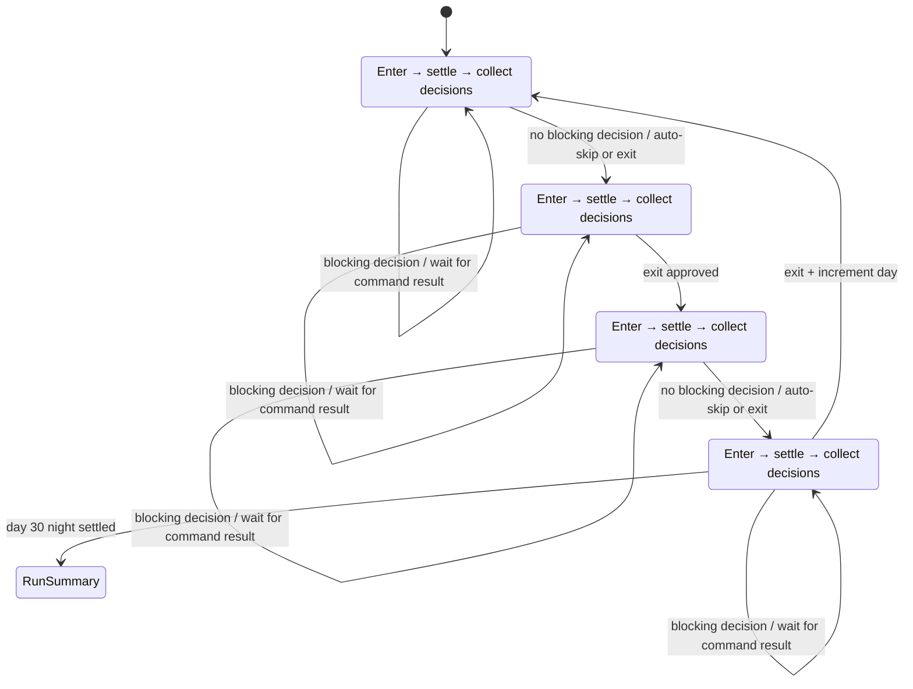
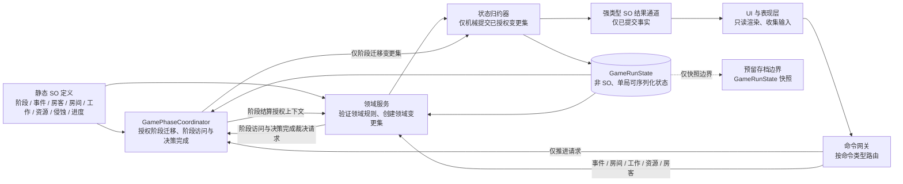

# 《旅馆·侵蚀日》SO 架构重构设计

**状态：已批准的架构设计**  
**范围：** Unity 项目的游戏运行时架构与数据边界；本文不包含代码、类的具体实现步骤、场景修改或资产迁移操作。  
**依据：** 《旅馆·侵蚀日》（暂定）策划案 v1.0，以及当前 `Assets/Scripts/Hotel` 与 `Assets/Scripts/Core/Events` 的实现。

## 1. 目标与架构决策

本设计将游戏从“多个 MonoBehaviour 单例直接持有并修改状态”的原型形态，调整为以下边界清晰的模型：

- **静态定义（Static Definitions）：** 使用 ScriptableObject（SO）承载可由策划编辑、可复用、跨局不变的规则、内容和数值。
- **单局状态（GameRunState）：** 使用普通、可序列化、非 SO 的运行时对象承载某一局中持续变化的数据。它不得作为 Project 资产保存，也不得被多个对局共享。
- **阶段唯一权威：** `GamePhaseCoordinator` 是唯一能授权阶段迁移、创建阶段迁移变更集，并门控阶段依赖操作与决策完成的运行时协调者。任何 UI、事件、工作、资源或侵蚀系统都不能自行改变当前天数或阶段。
- **显式命令与结果：** 命令先经命令网关路由：阶段迁移与决策完成由协调者授权；房间、工作、资源、房客等领域命令由对应领域服务验证并生成状态变更集。归约器机械提交已授权变更集；成功后的不可变结果才通过强类型事件通道发布给 UI、表现和日志。
- **表现只读：** UI 负责显示状态、收集输入和提交命令；不直接应用事件效果、不直接修改侵蚀、资源、房客或阶段状态。

该模型服务于策划案的核心循环：**审查招人 → 安排工作/房间 → 应对事件 → 观察变化 → 调整策略**，并确保“有决策时停留、无决策时自动跳过”的四阶段流程可测试、可追溯、可存档。

## 2. 当前实现的事实与问题

以下结论以当前代码为依据，旨在定义重构原因，不评价原型阶段的合理性。

|问题|代码依据|风险|目标状态|
|---|---|---|---|
|旧时间系统与阶段系统并存|`TimeManager` 独立维护时钟、`TimeState.currentDay` 和 `TimePhase`；`GamePhaseManager` 同时维护 `currentDay`、`GamePhase`。二者均提供 `AdvancePhase()`。|天数与阶段可能分叉；同一局存在两个推进入口和两套事件。|仅 `GameRunState.Phase` 表示阶段；仅 `GamePhaseCoordinator` 迁移。|
|阶段顺序与初始化不符合设计叙事|`GamePhaseManager` 在 `Awake()` 强制第 1 天 `Day`；其 `GamePhase` 枚举声明顺序为 Day/Dawn/Night/Dusk。|首日无法从策划案规定的黎明流程开始；枚举顺序不应承载规则。|阶段顺序由 `DayCycleDefinition` 显式定义：Dawn → Day → Dusk → Night → 次日 Dawn。|
|隐藏阶段的跳过逻辑只查询预生成事件|`GamePhaseManager.AdvancePhase()` 仅以 `EventManager.HasPreGeneratedEvents(nextPhase)` 决定 Dawn/Dusk 是否进入。|访客审查、可分配工作、强制管理等决策并不在判定中，违背“有决策时停留”。|协调者聚合所有决策提供者的 `DecisionRequirement`，而非只看事件队列。|
|事件触发条件未被使用|`EventConfig.triggerCondition` 标注为 reserved；`EventManager.PreGenerateDayEvents()` 只按阶段池、概率和随机挑选。|事件与房客状态、资源、历史、天数的相关性无法表达，和策划案不符。|事件条件使用可组合、可评估的定义对象；选择和结算基于同一快照。|
|UI 直接执行领域效果|`EventUI.ApplyEffects()` 直接遍历 `EventEffect`，并调用 `ErosionManager.Instance.ModifyErosion()`。|展示层同时成为规则执行层；非 UI 入口无法复用同一效果；结果难测试、难审计。|UI 只提交“确认/选择”命令；事件结算服务解析效果并经状态归约器更新状态。|
|全局单例承载可变领域状态|`GamePhaseManager`、`EventManager`、`TimeManager`、`ErosionManager` 均公开 `Instance`；多个 UI 和表现脚本直接读取或调用它们。|隐藏依赖、生命周期耦合、测试困难，也不利于多存档/重开局。|组合根创建本局上下文和服务；状态通过只读查询、命令和结果事件跨边界流动。|
|侵蚀模型过于全局|`ErosionManager` 仅维护一个 `ErosionState.erosionValue`，而策划案定义的是房客个体的 0–100 隐藏侵蚀度、同房/同层传播和颜色。|无法表达房间策略、揭示、误判率或结局平均侵蚀度。|每位房客在 `GameRunState` 内持有真实侵蚀和揭示状态；规则由侵蚀领域服务计算。|
|通用事件通道被用作工作流控制|当前 `EventProcessedEvent` 只有字符串事件 ID，`EventQueueEmptyEvent` 只有整数占位值。|调用方无法确认命令、选项、结算结果或所属阶段；工作流易被错误事件推进。|保留强类型 SO 通道用于已发生事实；以相关标识和只读结果载荷表达事件。命令不通过广播通道传递。|

## 3. 核心概念与所有权

### 3.1 静态定义与运行时状态

|类别|静态 SO 定义的职责|`GameRunState` 的职责|禁止事项|
|---|---|---|---|
|日循环/阶段|阶段顺序、阶段标签、可自动跳过策略、结算钩子配置。|当前天数、当前阶段、阶段处理状态、已停留/已结算标记。|SO 不保存当前天数、当前队列或已做选择。|
|事件|事件文本、适用阶段、候选权重、条件树、是否需要决策、选项、效果清单与表现资源。|已计划/已激活/已结算事件、随机种子或确定性选择记录、所选选项、结果日志。|SO 不记录“本局已触发次数”或“已选择”。|
|房客|原型档案、能力标签、活跃类型、叙事提示、可用肖像、可配置初始范围。|房客实例 ID、当前房间/工作、真实侵蚀、受伤与揭示状态、玩家手动标记、是否在旅馆。|SO 不保存当前房间、真实侵蚀或玩家标记。|
|房间/工作/资源|房间容量与楼层、岗位需求/产出规则、资源类型和上限。|已解锁房间、入住者、岗位分配、资源余额、设施状态。|SO 不保存库存、耐久或占用。|
|侵蚀/进度|颜色阈值、传播/治疗/饥饿等规则参数、解锁和结局判定规则。|每位房客的侵蚀值、全局修正、已解锁内容、局内历史、结局统计。|SO 不承载动态累计值。|

`GameRunState` 是一次游戏运行的唯一事实来源。服务可从中读取并通过受控归约写入；UI、SO、事件监听器和普通表现组件不得持有可写副本。运行时状态只可包含稳定 ID、值对象、集合和可序列化基础数据；不包含 `MonoBehaviour`、场景对象、SO 的可变引用或 UI 引用。

### 3.2 GamePhaseCoordinator 的唯一权限与阶段门控

`GamePhaseCoordinator` 负责本局阶段管线、阶段迁移和日边界。它是阶段**授权者**，不是所有领域命令的执行者；它拥有以下唯一权限：

1. 接受并授权“请求推进阶段”命令；为领域服务处理的阶段依赖操作和阻塞性 `DecisionRequirement` 完成请求提供唯一的阶段访问/完成裁决；
2. 计算下一逻辑阶段及跨越黑夜到黎明时的日数变更；
3. 调用阶段进入、结算、决策收集和退出边界的领域服务；
4. 在存在未决强制决策时阻止退出；
5. 在没有决策时记录自动跳过理由，并串行推进；
6. 创建阶段进入、自动跳过、退出和日数变更的授权阶段迁移变更集；对已获完成裁决的决策，创建或授权其 `PhaseRunState` 完成记录变更；
7. 在归约器成功提交该授权变更集后，发布阶段和结算结果事实。

房间分配、岗位分配、资源变化、房客招募/驱逐/标记等领域命令不经过协调者作为业务执行者：它们由命令网关直接路由到对应领域服务。服务必须先向协调者请求或查询当前阶段访问裁决，再验证本领域不变量，并生成自身的授权状态变更集。协调者只门控“此时能否执行”和“该结果能否完成当前决策”，不重实现房间容量、岗位适配、资源或房客规则。

归约器没有阶段决策权：它不计算下一阶段、不判断是否自动跳过、不增加天数，也不把普通领域变更升级为阶段变更；它仅按既定顺序机械应用已由协调者或相应领域服务授权的变更集。任何其他组件，包括事件、房间、工作、侵蚀、存档和 UI，都只能提交命令或提供查询/决策要求，不能改变 `GameRunState.Phase`。这条规则排除了 `GamePhaseManager` 与 `TimeManager` 同时作为权威的“双权威”状态。

## 4. 阶段模型与推进规则

### 4.1 固定循环

阶段的业务顺序固定为：

|序号|阶段|策划语义|典型可操作内容|默认推进|
|---:|---|---|---|---|
|1|Dawn（黎明）|新一天开始；访客可能到来；前夜结果已结算。|审查招募、需要选择的黎明事件。|有决策则等待；否则可自动跳至 Day。|
|2|Day（白昼）|主要经营时段。|分配日间工作、日间事件、房间/驱逐等任何阶段可用操作。|玩家请求推进；若没有强制决策可自动完成空阶段。|
|3|Dusk（黄昏）|外出房客归来；访客或互动事件可能到来。|审查、黄昏互动事件。|有决策则等待；否则可自动跳至 Night。|
|4|Night（黑夜）|危险高发和夜间生产时段。|守夜/值班安排、夜间事件应对。|玩家请求推进；夜间结算后进入次日 Dawn。|

“任何阶段可用”的房间管理、玩家标记和主动驱逐不自动使阶段停留；只有系统明确生成的、**必须在离开该阶段前解决**的 `DecisionRequirement` 才阻塞推进。由此既保留玩家随时管理的自由，也不会因可选操作无限阻塞自动跳过。

### 4.2 阶段管线

每次进入一个逻辑阶段，协调者必须按以下固定顺序处理；同一阶段不可重复结算：

1. **Enter（进入）：** 协调者创建包含当前阶段与必要日数变更的阶段迁移变更集；归约器提交后建立阶段上下文快照，并发布“已进入”的事实用于表现刷新。
2. **Settle（结算）：** 执行该阶段定义的自动结算，例如半天岗位产出、资源消耗、房间/同层侵蚀传播、持续天气、到期效果与日志条目。夜间事件至少一项的规则在计划/结算边界得到保证，而不是依赖 UI。
3. **Collect decisions（收集决策）：** 事件规划、访客到来、工作分配检查及其他决策提供者基于结算后快照生成有稳定 ID 的待处理决策。每项决策声明阻塞性、来源、可用选项和完成条件；只有协调者可授权其完成。
4. **Wait or auto-skip（等待或自动跳过）：** 若存在阻塞性未决决策，状态设为等待，协调者拒绝离开请求；UI 从只读决策列表呈现内容。若不存在，写入“自动跳过”日志及原因，并自动请求下一阶段。
5. **Exit（退出）：** 仅当所有阻塞决策已处理且阶段结算完成时，封存该阶段日志与结果，确定下一阶段并回到 Enter。Night → Dawn 时增加天数；达到第 30 天黑夜结算条件后转入结局/结算边界，而不是创建第 31 天。



### 4.3 决策与自动跳过规则

- 访客审查、事件选项、必须安排的岗位/值班、必需的突发事件回应属于阻塞决策。
- 纯通知事件、已经由规则自动结算的天气变化、可选的房间整理和玩家个人标签不是阻塞决策。
- 每日黑夜必须产生至少一个夜间事件；若该事件不要求选择，仍须经过结算与日志记录，不能因为没有弹窗而被遗漏。
- 白昼/黄昏的日间事件依据条件、天数、房客构成、资源和历史进行权重选择；它们可以为空。
- Dawn/Dusk 不是“隐藏阶段”。它们是完整的业务阶段，只是通常没有决策时允许自动跳过。
- 自动跳过必须写入可审计日志，例如“第 N 日黄昏：无待处理决策，自动进入黑夜”，并在结果事件中标明原因。
- 命令网关按命令类别路由：仅推进请求交给协调者；事件、房间、岗位、资源和房客请求交给对应领域服务。所有阶段依赖命令均须先通过协调者的阶段访问裁决；若命令意图完成阻塞决策，领域服务还须取得协调者的完成裁决。过期、重复、目标阶段不符或试图在不允许阶段完成决策的请求必须被拒绝而不产生副作用。

## 5. SO 定义目录与类别

SO 的职责是创作和规则配置。以下类别表示目标模型，不要求文件名或一个类型一一对应。

|类别|定义内容|主要消费者|
|---|---|---|
|Day cycle / phase|`DayCycleDefinition`、每个 `PhaseDefinition`：顺序、显示信息、自动结算策略、允许的决策来源。|阶段协调者、表现层。|
|Event|事件定义、事件池、条件节点、选项定义、效果定义、权重/冷却/重复规则、叙事表现资源。|事件规划与结算服务。|
|Tenant|房客原型、能力标签、活跃类型、入场线索、肖像、可选初始侵蚀规则引用。|招募、工作、侵蚀、UI 展示。|
|Room|房间/楼层定义、容量、隔离属性、解锁条件、环境修正。|房间服务、侵蚀服务、进度服务。|
|Job|岗位定义、适配标签、适用阶段、基础产出/消耗、效率修正。|工作分配和资源结算服务。|
|Resource|资源类型、显示和上下限规则、可用性约束。|资源归约器、UI。|
|Erosion|颜色阈值、房间/楼层传播、医疗、饥饿、隔离、事件影响规则。|侵蚀结算服务。|
|Progression|房间解锁、天数节奏、结局、奖章/多周目限制的规则定义。|进度与结局服务。|

事件条件不得再以未解释的自由文本 `triggerCondition` 作为可执行依据。创作层可保留文字备注，但可执行条件应由结构化条件定义组成，例如阶段、天数区间、资源阈值、房客/颜色构成、受伤状态、房间关系、历史标记和概率。事件效果同样应是描述性的结构化定义，而非 UI 可直接解释的调用指令。

## 6. 运行时状态、领域服务与状态归约

### 6.1 `GameRunState` 的建议边界

`GameRunState` 至少包含以下聚合状态：

- **Run metadata：** 对局 ID、规则版本、随机种子、当前天数、当前阶段、阶段状态版本、运行是否已结算。
- **Phase state：** 当前阶段的 Enter/Settled/Waiting/Exiting 状态、待处理决策列表、已处理决策记录、阶段日志。
- **Tenant state：** 房客实例、原型 ID、真实侵蚀值、颜色计算结果、揭示状态、手动标记、伤病、当前位置、工作、活跃状态和局内标签。
- **Hotel state：** 已解锁房间、入住关系、岗位、设施/环境状态。
- **Economy state：** 资源余额、消耗/产出记录、临时修正。
- **Event history：** 已计划、已呈现和已结算事件，以及防重复/冷却和叙事标志。
- **Progression and summary state：** 已达成解锁、统计、误判率所需信息，以及完成时的结局快照。

颜色是由真实侵蚀和 `ErosionDefinition` 阈值推导的系统事实；玩家手动标签是独立的笔记，不影响计算。这样可正确支持绿色/黄色/红色的效率、传播、揭示和误判率，同时不向玩家 UI 泄露真实数值。

### 6.2 领域服务与归约器

领域服务只处理规则和状态变换；它们不依赖 UI、场景对象或全局单例。建议职责如下：

|服务/归约边界|拥有的规则与授权范围|输入|输出|
|---|---|---|---|
|Command gateway|按命令类型路由；确保命令带目标、对局和状态版本；不拥有领域或阶段规则。|UI/适配层命令请求。|协调者或对应领域服务的验证请求。|
|`GamePhaseCoordinator`|唯一授权阶段迁移、日边界、自动跳过、阶段依赖操作访问与阻塞决策完成；创建阶段迁移变更集。|推进请求、来自领域服务的阶段访问/决策完成裁决请求、只读状态。|授权/拒绝结果、阶段变更集、阶段事实。|
|Event planning service|按阶段规划候选事件；保证夜间最少事件；评估结构化条件、权重、历史。|状态快照、事件定义、随机源。|待处理事件决策/自动事件计划变更集，交由协调者纳入阶段管线。|
|Event resolution service|在协调者许可下验证事件选择、解析效果定义、生成事件领域变更集。|已获阶段访问许可的事件命令、状态快照。|授权的事件状态变更集和事件结算事实。|
|Tenant / recruitment service|在协调者许可下执行审查、招募、拒绝、驱逐、揭示和标记规则。|已获阶段访问许可的房客命令、定义、状态。|授权的房客/日志/资源变更集。|
|Room and job service|在协调者许可下验证入住约束、隔离关系、岗位适配与半天产出。|已获阶段访问许可的安排命令或阶段结算上下文。|授权的房间/工作/资源变更集。|
|Erosion service|个体侵蚀、同房/同层传播、医疗、饥饿、阈值颜色和揭示。|协调者授权的阶段结算上下文、事件结果、状态。|授权的房客侵蚀变更集和颜色变化事实。|
|Resource / progression service|资源合法性、解锁、结局和奖章统计。|协调者授权的阶段结算或已获许可的领域效果、状态。|授权的资源/进度/结局变更集。|
|State reducers|只机械应用已授权的原子变更集、保持表示层不变量、记录版本/日志；不路由命令、不验证业务规则、不决定阶段。|协调者或领域服务已授权的变更集。|新的有效 `GameRunState` 与提交确认。|

效果解析与状态归约必须是一个事务边界：要么命令被验证、获授权后完整地提交所有效果与日志，要么完全不修改状态。命令网关负责路由；协调者授权阶段迁移、阶段依赖访问和决策完成；领域服务授权自己的领域变更；归约器只写入状态。阶段变更集只能由协调者创建，归约器不得推导或补充阶段迁移。结果事件只在提交成功后发布。

## 7. 命令、强类型事件通道与 UI 边界

### 7.1 命令请求不等于事件

**命令请求**表示“希望系统做什么”，需要明确的路由、验证、授权与结果。命令网关仅将“请求推进阶段”路由给协调者；确认事件、选择事件选项、房间分配、岗位分配、资源操作和房客操作均路由给对应领域服务。领域服务在处理阶段依赖命令前必须取得协调者的阶段访问裁决；若该命令意图完成阻塞决策，还必须取得协调者的决策完成裁决。只有协调者可以授权决策完成及阶段迁移。示例包括：请求推进阶段、确认事件、选择事件选项、招募/拒绝访客、分配岗位、调整房间、驱逐房客、设置玩家标记和请求解锁。

**强类型事件通道**表示“已经发生了什么”，只在状态提交后发布。示例包括：阶段已进入、阶段自动跳过、决策已生成、事件已结算、资源已变更、房客侵蚀/颜色已变更、房客已移动、对局已结算。

SO 事件通道适合跨场景、可在 Inspector 绑定的**通知**，延续当前 `GameEvent<T>` 的优势；它们不应用于命令路由、返回值或状态所有权。每一种结果使用语义明确的强类型载荷，至少包含对局/状态版本、相关实体 ID 和来源阶段，避免目前 `string eventId` 或 `int 0` 这类歧义控制载荷。

### 7.2 UI 的唯一职责

|UI 层可以做|UI 层不得做|
|---|---|
|从只读运行时查询或投影中渲染天数、阶段、资源、房客公开信息、决策和日志。|修改 `GameRunState`、调用侵蚀/资源归约器、解释事件效果。|
|将按钮、拖拽和确认映射为命令请求，显示接受/拒绝结果。|自行推进阶段或因为面板关闭而认定事件已结算。|
|订阅已提交的强类型结果事件以刷新动画、弹窗、背景和文本。|把 SO 通道当作可写全局状态，或从事件回调中隐式串联业务流程。|
|基于“当前是否存在阻塞决策”显示推进按钮的可用性。|通过暂停时钟/速度来替代阶段管线的等待状态。|

因此，现有 `EventUI` 的“接收弹窗 → 直接遍历 `EventEffect` → 直接调用 `ErosionManager`”模式必须在后续实现中移除。UI 应提交带事件/选项 ID 的选择请求；事件结算服务确认后，UI 仅消费“已结算”结果显示文本、动画和日志。

### 7.3 数据流



## 8. 目录布局（目标）

以下布局描述责任归属，不要求在本设计阶段创建任何目录或文件。命名可随项目既有规范微调，但不得混合 Authoring、Runtime 和 Presentation 职责。

```text
Assets/Scripts/
  Hotel/
    Authoring/
      DayCycle/
      Events/
      Tenants/
      Rooms/
      Jobs/
      Resources/
      Erosion/
      Progression/
    Runtime/
      State/
        GameRunState
        TenantRunState
        HotelRunState
        PhaseRunState
      Coordination/
        GamePhaseCoordinator
      Commands/
        CommandGateway
      Services/
        Events/
        Tenants/
        Rooms/
        Jobs/
        Erosion/
        Resources/
        Progression/
      Reducers/
      Queries/
      Results/
    Presentation/
      UI/
      Camera/
      ViewModels/
    Integration/
      Composition/
      SaveLoadBoundary/
  Core/
    Events/
      TypedResultChannels/
  Legacy/
    TimeSystem/
      TimeManager
      TimeState
      TimeUI
      TimeControlUI
      TimePhaseChangedEvent
      TimeSpeedChangedEvent
      related legacy time listeners, data and editor helpers
```

`Legacy/TimeSystem` 是明确的弃用隔离区，而不是第二套可用运行时架构。新系统不得引用其中的类型、通道或状态；只有迁移适配层在受控、短期、单向的过渡期内可以读取旧入口并转成新命令。适配层不得将新状态反向写入旧时间状态。

## 9. 现有组件的演进与弃用规则

### 9.1 阶段与时间

- `GamePhaseManager` 的职责演进为 `GamePhaseCoordinator`：保留“阶段推进”这一业务概念，但不保留公开可写字段、单例访问、协程延迟初始化或仅由事件预生成决定跳过的实现模式。
- 在正式替换的切换点，旧 `GamePhaseManager` 必须被移除或变为只转发到协调者的临时外观；同一运行时绝不能同时存在两个可提交阶段迁移的对象。
- `TimeManager`、`TimeState`、`TimeUI`、`TimeControlUI`、`TimePhaseChangedEvent`、`TimeSpeedChangedEvent` 及相关旧时间组件必须标记为 deprecated，并在后续迁移时移动到 `Assets/Scripts/Legacy/TimeSystem/`。**本设计不执行该移动。**
- `DayStartedEvent`、旧时钟/速度相关监听器及 `TimeEventAssetCreator` 等相关辅助内容也应一并审计并归入上述弃用范围，或在确认不再被引用后删除；本设计不做删除决定。
- `NextPhaseButton` 后续只提交推进命令；`PhaseUI` 和 `ParallaxBackground` 后续只订阅新的阶段结果或读取只读投影，不读取单例字段。

### 9.2 事件与侵蚀

- `EventManager` 从“持有队列、预生成并驱动 UI”演进为事件规划/结算领域服务及其协调边界。队列属于 `GameRunState` 的阶段状态，不属于 MonoBehaviour 单例。
- `EventConfig` 演进为内容定义：其触发条件、可选项和效果结构化；不在其中保存局内队列或结果。
- `ErosionManager` 的全局数值模型被按房客的侵蚀领域服务和状态替代。若保留名称，仅能作为不持有状态的过渡入口，不能继续是 `Instance` 权威。
- `EventUI` 和 `ErosionUI` 在迁移后只显示结果。事件效果必须统一由事件结算服务解析，避免 UI 绕过验证直接修改侵蚀。

## 10. 分阶段迁移原则（不破坏当前玩法）

这是迁移顺序和兼容原则，不是具体任务清单或实现方案。

1. **建立并验证新边界：** 先引入静态定义与非 SO 单局状态的概念边界，在不替换现有可玩流程的前提下建立只读投影和领域规则测试基线。
2. **替换状态写入路径：** 新功能和逐步迁移的功能仅通过命令网关、协调者或相应领域服务生成已授权变更集，并由归约器写入 `GameRunState`；保留旧 UI 显示适配，但不得让它直接修改新状态。
3. **以一个完整阶段循环验证协调者：** 用 Dawn → Day → Dusk → Night → Dawn 的单一流程验证进入、结算、决策等待、自动跳过、日志和日边界，再将旧推进入口切换到该协调者。
4. **迁移事件结算：** 将 `EventUI` 的效果应用改为提交命令；先确保既有事件仍能显示和结算，再扩展结构化条件与个体侵蚀效果。
5. **迁移房客/房间/工作/侵蚀聚合：** 逐域搬迁运行时事实到 `GameRunState`，并以兼容读取层保持当前 UI 可显示，直到旧单例不再被消费者依赖。
6. **完成旧时间隔离：** 在新协调者成为唯一阶段权威且引用已清零后，执行已声明的 deprecated 标记和 `Legacy/TimeSystem` 移动；不得在此之前同时运行新旧阶段推进。
7. **收口与删除决策：** 以引用审计、存档边界测试和完整 30 天回归为依据，决定删除过渡适配层。删除前必须确认不存在场景、Prefab、SO 或代码引用。

每一阶段的成功标准是“当前可玩循环没有第二个状态权威、已有入口可通过适配使用同一规则”，而不是仅以编译通过为准。

## 11. 存档/读档预留边界

存档系统在本架构中仅是 `GameRunState` 的**运行时快照边界**：保存时读取一个一致、已提交的状态快照；加载时构造新的单局状态，再由组合根和协调者恢复表现投影。静态 SO 通过稳定定义 ID 被重新解析，不能被序列化为可变局内数据。

本设计不规定序列化库、文件格式、加密、槽位 UI、自动保存实现或失败恢复机制。策划案中的“黎明、事件结算后自动保存”“三个独立槽位、仅保留最近记录、不可复制”是未来存档需求的业务约束，应在实现该边界时验证；它们不改变阶段权威或状态所有权。

## 12. 验证与测试策略

验证围绕确定性状态变换，而不是场景单例和 UI 时序：

|层级|验证重点|
|---|---|
|定义验证|所有 SO 引用 ID 有效；阶段循环恰有 Dawn/Day/Dusk/Night；事件的条件、选项和效果结构完整；阈值、资源与解锁规则合法。|
|领域单元测试|事件条件评估、权重选择、夜间至少一事件、侵蚀传播/阈值、工作效率、资源约束、驱逐结果和结局统计。使用固定随机种子。|
|命令路由与归约器测试|仅推进命令到达协调者；事件、房间、岗位、资源和房客命令到达对应服务；需要完成阻塞决策时，服务必须取得协调者的完成裁决；无协调者阶段访问许可时服务拒绝阶段依赖操作；归约器只应用授权变更集，且不能自行产生阶段迁移。拒绝过期/重复/非法命令后状态不变；状态版本和日志准确。|
|阶段流程测试|四阶段完整管线；阻塞决策等待；无决策自动跳过与日志；Night → Dawn 只增一天一次；第 30 天黑夜后直接进入结算。|
|集成测试|事件选择经命令结算后产生资源/侵蚀/日志结果；UI 不直接写状态；结果通道仅在成功提交后发出。|
|迁移回归|旧入口适配时不产生双推进；当前弹窗、阶段显示、背景和推进按钮仍在同一事实流上工作；迁移完成后引用扫描不再发现新系统依赖 `Legacy/TimeSystem`。|
|长局模拟|固定种子和多种房客/资源组合跑满 30 天，验证无死锁、无重复结算、无无法解决的阻塞决策，并核对结局统计。|

关键运行时不变量包括：当前对局只有一个阶段授权者；只有协调者能创建阶段迁移变更集，归约器不能决定或推导迁移；每阶段至多结算一次；每个阻塞决策至多结算一次；真实侵蚀始终在 0–100 内；房客容量与资源余额满足规则；玩家标记不改变真实侵蚀；所有已发布结果都能在运行状态日志中找到对应记录。

## 13. 明确非目标

- 不在本文或基于本文的第一步中实现具体 C# 类型、接口、序列化器、DI 框架、MonoBehaviour 生命周期或场景装配代码。
- 不修改当前 Unity 场景、Prefab、SO 资产、UI 布局、美术、音频或输入绑定。
- 不在此阶段搬移、删除或重命名 `Legacy/TimeSystem` 中的任何文件；迁移要求仅作架构约束记录。
- 不确定最终数值平衡、完整事件库、20+ 房客内容、房间消耗、奖章商店价格或高难模式参数；这些均由 SO 内容生产和后续数值设计决定。
- 不实现存档格式、槽位管理、加密或云端同步。
- 不把 SO 作为单局可变状态容器，也不以新的“总管理器”单例替代现有单例。

## 14. 自检结论

本文已检查以下项：

- 未遗留 `TODO`、`TBD`、占位符或未决实现措辞；
- 阶段顺序在文字、表格和 Mermaid 状态图中一致，均为 Dawn → Day → Dusk → Night；
- “有决策停留、无决策自动跳过”统一以阻塞性 `DecisionRequirement` 定义，不再将 Dawn/Dusk 称为隐藏阶段；
- `GamePhaseCoordinator` 被定义为唯一阶段迁移权威，迁移规则明确禁止新旧双权威；
- 命令网关、协调者、领域服务和归约器的路由/授权边界一致：协调者仅授权阶段迁移、阶段访问和决策完成，领域服务创建本域变更集，归约器仅机械提交；
- SO 静态定义、非 SO `GameRunState`、命令、结果事件和 UI 的写入边界相互一致；
- 旧时间系统的弃用与目标目录已明确记录，且本文没有执行迁移。
