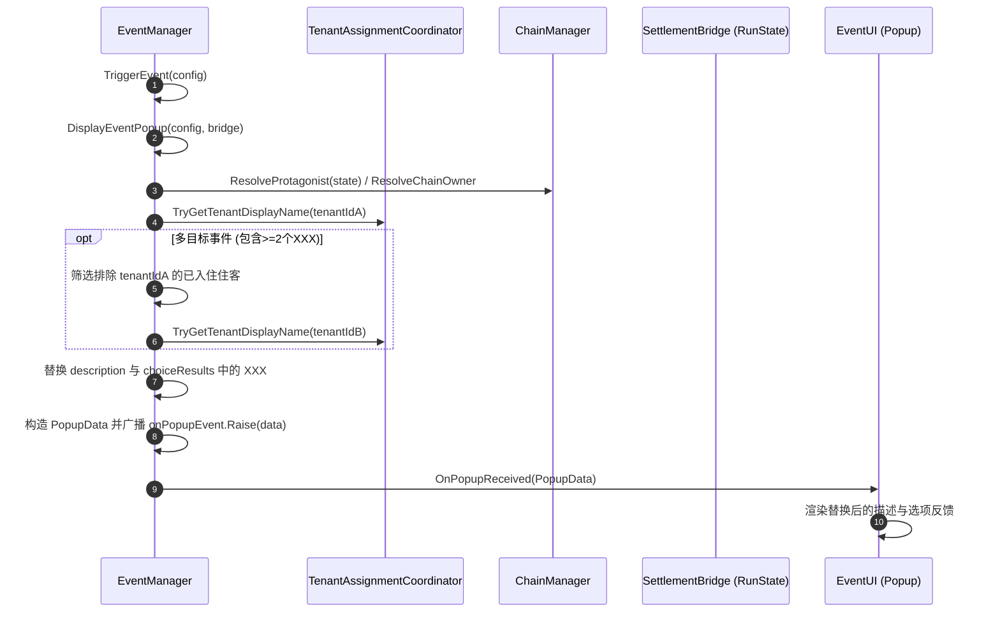

# 单人/特定事件住客目标文本占位符替换设计规范

## 1. 概述与设计目标
在事件系统呈现阶段，当事件文本中包含占位符 `XXX` 时，将其动态替换为当前事件目标住客的实际显示名称（Display Name），提升剧情沉浸感与可读性。

### 核心约束与范围
1. **结算与目标选择逻辑解耦**：保留现有 `EventManager` 对单人事件（Personal Event）、链式事件（Chain Event）及常规事件的目标住客解析逻辑（`ResolveProtagonist`）以及后续效果结算流程（`EventEffectManager` / `EventEffectExecutor`）。
2. **纯展示层数据映射**：替换操作发生于弹窗数据生成阶段（`EventManager.DisplayEventPopup`），对弹窗呈现的 `description` 与 `choiceResults` 进行字符串替换，不修改原始 `EventConfig` 资产，亦不改变事件效果的实际结算目标。
3. **多住客争吵事件（如 `d07_argument`）扩展支持**：针对包含多个 `XXX` 占位符的特殊多住客事件，按顺序选取两个不同的已入住/已分配（Assigned）住客，依次替换文本中的两个 `XXX`。
4. **安全降级与健壮性**：在无可用住客、目标不存在或显示名查询失败时，平滑降级（如保留原占位符或采用保底显示名），确保弹窗正常生成，不阻塞事件队列推进与阶段结算。
5. **代码规范约束**：未来代码实现时遵循项目规范，不引入非必要注释，不修改既有无关联逻辑。

---

## 2. 详细设计

### 2.1 目标住客解析与名称获取流程

#### 2.1.1 单目标住客（主目标）
- 调用现有的 `ResolveProtagonist(bridge.RunState)`，该方法按以下优先级解析主目标住客 ID：
  1. 若为链式事件（`ChainStep`），调用 `ChainManager.ResolveChainOwner` 获取链所有者。
  2. 若配置了 `requiresTenantId` 且该住客已分配房间，优先使用该住客。
  3. 若未指定，从所有当前已分配房间的住客列表（`state.Tenants` 中 `RoomId` 非空）中，基于确定性伪随机种子选取一个住客。
- 通过 `TenantAssignmentCoordinator.Instance.TryGetTenantDisplayName(tenantId, out string displayName)` 获取住客的友好显示名称。若查询失败，降级使用 `tenantId`。

#### 2.1.2 多目标住客解析（如 `d07_argument` 含有两个 `XXX`）
- 针对文本中包含多个 `XXX` 占位符且需要两人交互的事件：
  - 第一个目标（Target A）：使用上述解析得出的主目标住客 ID。
  - 第二个目标（Target B）：从已分配房间的住客列表中排除 Target A，若剩余住客数量 $\ge 1$，通过确定性伪随机（基于相同的随机因子序列或偏移种子）选择一位不同的住客。
  - 若当前已分配住客仅有 1 位或不足 2 位：
    - Target B 降级策略：使用保底文本（例如保留 `XXX` 或降级为预设通用代称），保证不发生数组越界或重复绑定同名导致逻辑混乱。

### 2.2 文本替换阶段（Popup Data Generation）
在 `EventManager.DisplayEventPopup(EventConfig config, SettlementBridge bridge)` 生成 `PopupData` 时：
1. **检测占位符**：检查 `config.eventDescription` 以及各选项的 `choiceResult` 是否包含 `XXX`。
2. **执行替换逻辑**：
   - 提取格式化后的住客名字列表（`tenantNames`）。
   - 对 `description`：按 `XXX` 的出现顺序依次替换为 `tenantNames[0]`、`tenantNames[1]`。
   - 对 `choiceResults`：各选项反馈文本中的 `XXX` 保持与描述中一致的映射关系替换。
3. **传递到 `PopupData`**：
   - `data.description = formattedDescription;`
   - `data.choiceResults[i] = formattedChoiceResult;`
4. **事件效果目标保持不变**：`data.confirmEffects` 与 `data.choiceEffects` 保留既有定义，`_currentProtagonistTenantId` 仍作为事件结算的主目标。

---

## 3. 数据流与时序

---

## 4. 边界情况与安全降级

| 场景 | 边界表现 | 处理与降级策略 |
| :--- | :--- | :--- |
| **无已分配住客** | `ResolveProtagonist` 返回 `null` | 文本替换跳过或安全保持原样 `XXX`，不产生空引用异常。 |
| **仅 1 名已分配住客，但事件包含 2 个 `XXX`** | 无法选出第二个不同的住客 | Target A 替换为该住客名字，第二个 `XXX` 保留或降级处理，不抛出异常。 |
| **`TenantAssignmentCoordinator` 未初始化** | 无法通过 UI lookup 查询显示名 | 降级直接使用 `tenantId` 字符串作为显示名。 |
| **选项包含 `XXX` 但描述不包含** | 局部占位符替换 | 统一使用解析出的目标住客名称进行对应替换。 |
| **文本中无 `XXX`** | 常规文本 | 直接沿用原始文本，无额外字符串分配开销。 |

---

## 5. 涉及文件清单

- **核心修改文件**：
  - `Assets/Scripts/Hotel/Managers/EventManager.cs`（在 `DisplayEventPopup` 中接入住客名称解析与占位符替换辅助方法）。
- **只读依赖/交互文件**：
  - `Assets/Scripts/Hotel/Managers/TenantAssignmentCoordinator.cs`（`TryGetTenantDisplayName` 提供显示名查找）。
  - `Assets/Scripts/Hotel/Managers/ChainManager.cs`（链事件所有者解析）。
  - `Assets/Scripts/Hotel/Data/EventConfig.cs`（事件配置结构定义）。
  - `Assets/Scripts/Hotel/Data/GamePopupEvent.cs` / `PopupData`（弹窗数据承载实体）。

---

## 6. 测试与验收标准

1. **单人事件占位符替换**：
   - 触发含单个 `XXX` 的事件时，弹窗描述与选项反馈中的 `XXX` 正确替换为目标住客的名字。
2. **多住客争吵事件（`d07_argument`）**：
   - 当旅馆内有 $\ge 2$ 名已入住住客时，`XXX和XXX在走廊里大声争吵` 正确替换为两名不同住客的名称（例如：`张三和李四在走廊里大声争吵...`）。
   - 两名住客名称不可相同。
3. **链式事件兼容性**：
   - 链式事件触发时，替换的名字与 `ChainManager` 中该链绑定的住客（Owner）一致。
4. **效果结算一致性**：
   - 选择选项后，事件效果（如增减属性、好感度、物品等）对正确的住客正常结算，未受文本替换影响。
5. **极端边界验证**：
   - 无住客或住客不足时触发事件，游戏不报错，弹窗正常显示并可点击推进，事件队列正常清空与结算。
